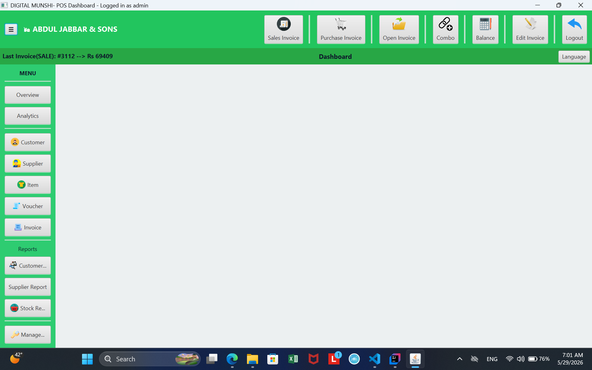
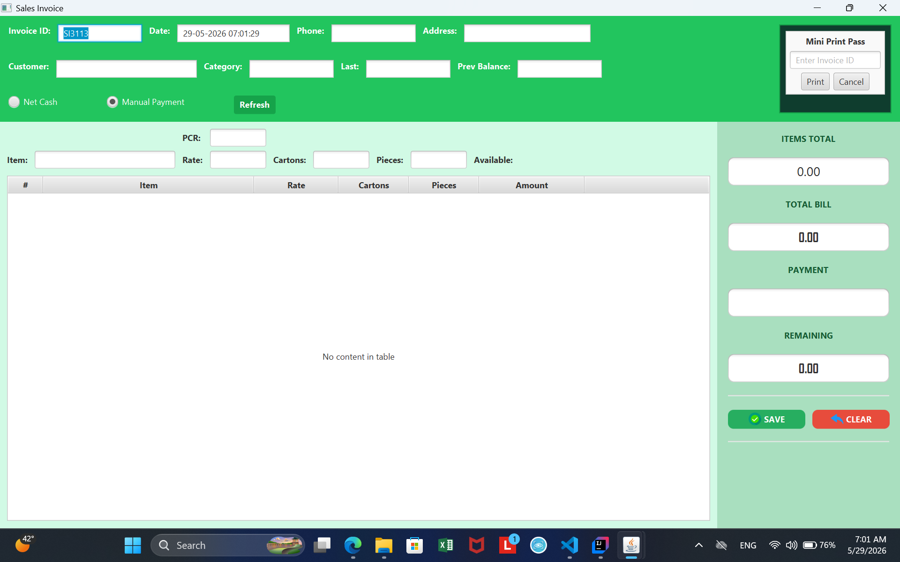
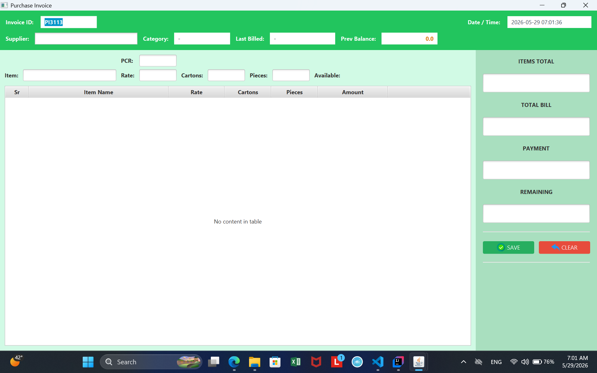
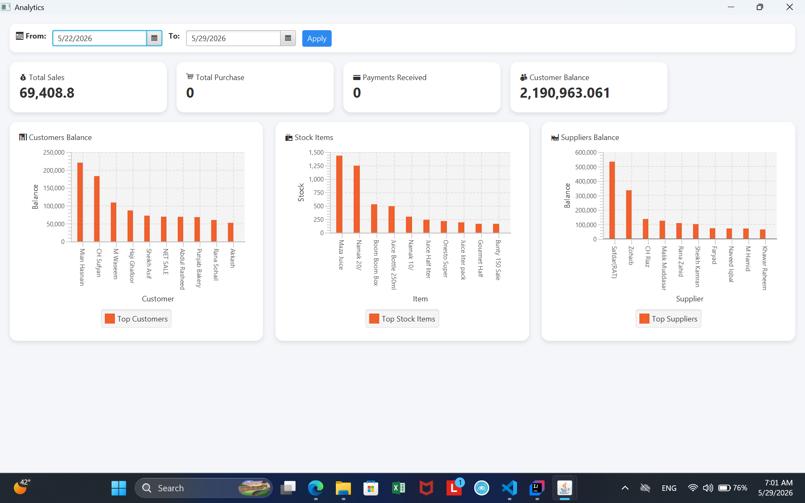

# 💼 Digital Munshi - POS System

## 📌 Overview
Digital Munshi is a desktop-based Point of Sale (POS) application developed using JavaFX and SQLite.

It is designed to manage sales, customers, invoices, inventory, and stock in an efficient and user-friendly way.  
The project follows **MVC architecture** with clean separation of concerns.

---

## ✨ Features

- 🧾 Sales Invoice Management
- 👤 Customer Management (Add / Update / Delete)
- 📦 Product & Stock Management
- 💰 Automatic Billing System
- 🔍 Search and Filter functionality
- 🖥️ JavaFX Modern UI
- 🧾 Invoice Printing (PDF / Receipt support)

---

## 🛠️ Tech Stack

- Java
- JavaFX (FXML)
- SQLite Database
- MVC Architecture
- DAO Pattern

## 📸 Screenshots

### MainView

### Sales Invoice

### Purchase Invoice

### Analytics

